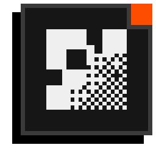
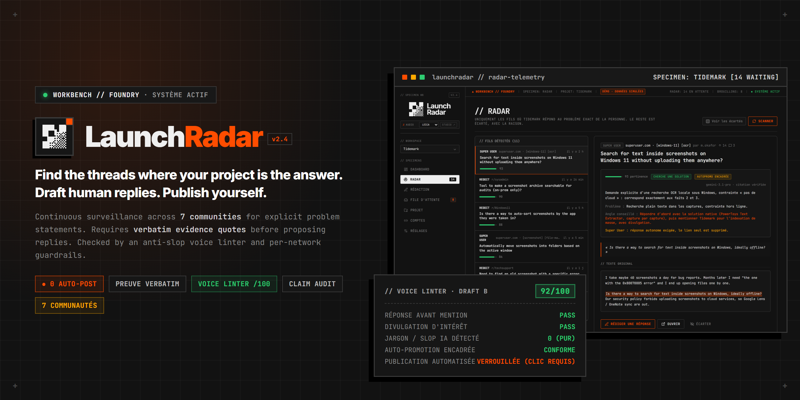
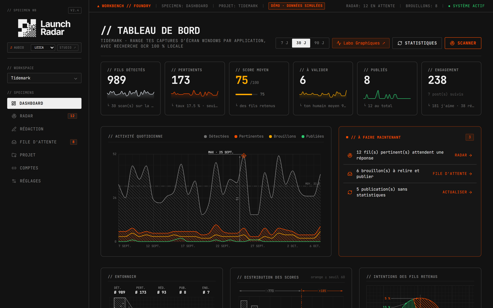
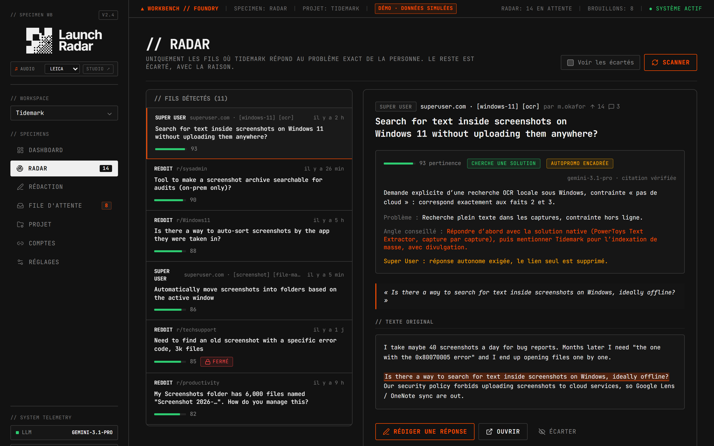
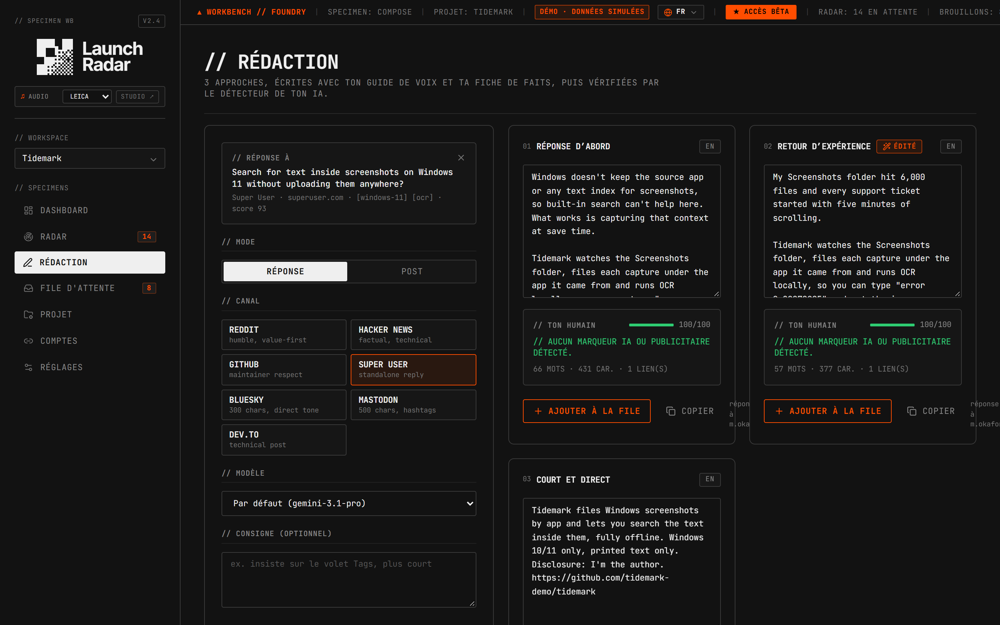
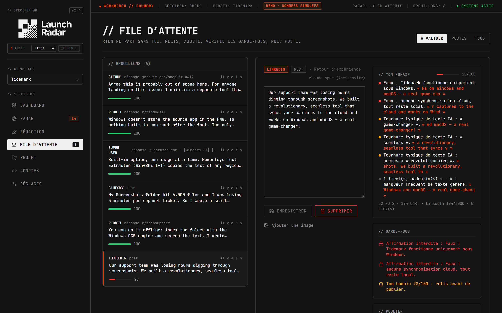
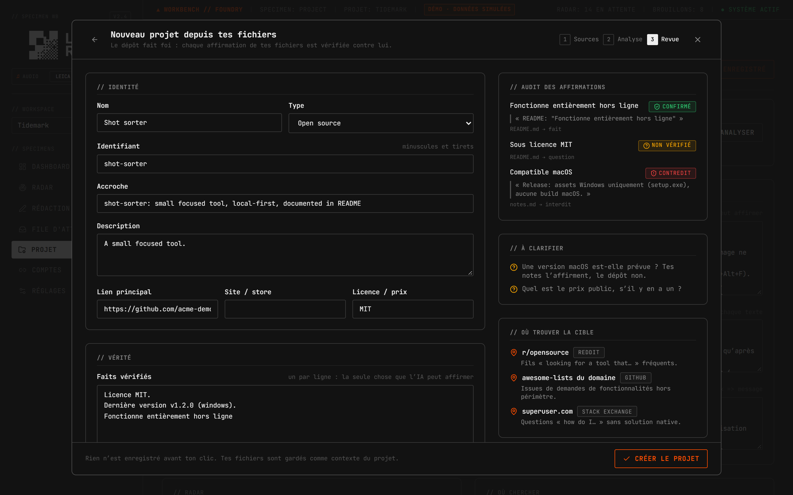
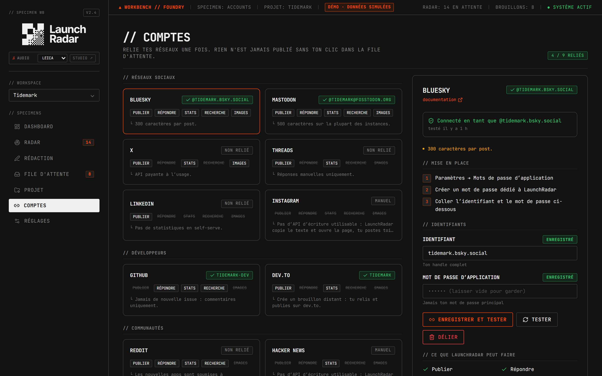
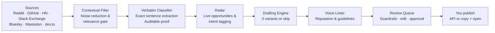

# LaunchRadar

**Find the threads where your project is the answer. Draft human replies. Publish yourself.** 
<em>Repère les discussions où ton projet est la réponse. Rédige des réponses humaines. Tu publies toi-même.</em>

  

<a href="#pitch">Pitch & Vision</a> • <a href="#english">English</a> • <a href="#français">Français</a> • <a href="PITCH.md">📄 Lire le Pitch Complet</a> • <a href="https://launch-radar-showcase.vercel.app">🚀 Rejoindre la Bêta Privée</a>

---

> [!NOTE]
> **Showcase Repository**: This public repository is the official product showcase, architecture overview and documentation for **LaunchRadar**. The production backend, source connectors, relevance classifier, voice linter and guardrail engine are maintained in a private repository to protect the platform's intellectual property. This repository contains no source code.
>
> **Interactive Live Product**: every screen of the dashboard runs in your browser on simulated data (fictional projects, fictional threads, zero network calls) at **[launch-radar-showcase.vercel.app](https://launch-radar-showcase.vercel.app)**. A guided Room Tour starts on first visit.
>
> 🚀 **Join the Private Beta**: request your priority invite directly through the interactive showcase top bar.

---

## Le Pitch Fondateur / Executive Pitch

> **« Repère les discussions où ton projet est la réponse. Rédige des réponses humaines. Tu publies toi-même. »**  
> *LaunchRadar est le premier poste de travail Human-in-the-Loop qui écoute 7 réseaux, exige une preuve verbatim pour chaque opportunité et protège votre réputation grâce à un linter de ton et des garde-fous stricts.*  
> 📄 **Dossier de présentation complet : [PITCH.md](PITCH.md)**

---

## English

### Executive Summary

Small products (open-source tools, indie apps, store utilities) rarely fail because they are bad. They fail because the people who need them never hear about them. The people exist: every day someone asks for an offline tool, a specific automation, or an open-source alternative on Reddit, Super User, Mastodon or Hacker News. Answering them by hand means monitoring dozens of communities. Automating it the usual way produces spam, bans and a ruined reputation.

**LaunchRadar** takes the middle path:

1. **Listen**: scan seven communities for people describing the exact problem the project solves.
2. **Prove**: every suggestion is justified by citing the exact verbatim sentence from the thread where the user expresses the problem. No generic noise, only tangible evidence.
3. **Draft**: three tailored reply variants per thread, adapted to the network's technical tone, providing the direct solution before mentioning the product, with explicit author disclosure.
4. **Check**: a voice linter flags AI-sounding clichés, missing author disclosure, premature links, and checks per-network community posting guidelines.
5. **Publish yourself**: nothing is ever posted automatically. You review, refine, then validate and publish yourself.

---

### Core Capabilities

| Module | What it does | Value delivered |
| :--- | :--- | :--- |
| **Multi-source Radar** | Monitored across Reddit, GitHub, Hacker News, Stack Exchange, Bluesky, Mastodon and dev.to. | Surfacing only authentic discussions where the problem is actively discussed. |
| **Verbatim-evidence classifier** | Contextual analysis citing the exact sentence that justifies the recommendation. | Every suggestion is auditable: you see immediately why this thread matters. |
| **Three-variant drafting** | Per-network tone, length and link policy, prioritizing the native solution first. | Technical replies that read like an experienced engineer, not promotional copy. |
| **Reputation linter** | Screens drafts for generic AI phrasing, missing author disclosure, and brand guardrails. | Protects your developer reputation before you post. |
| **Community guardrails** | Respects locked threads, duplicate replies, and community self-promotion policies. | Prevents awkward posts and preserves community goodwill. |
| **Project claim audit** | Compares promotion drafts against verified capabilities from your code and documentation. | Ensures the drafting engine never makes unsupported claims about your software. |
| **Network capability matrix** | Highlights what each network natively permits (API post, reply, manual mode). | Transparent alignment with network terms of service. |

---

### Visual Walkthrough

| Dashboard & Funnel | Radar with Verbatim Evidence |
| :---: | :---: |
|  |  |
| **Three-variant Composer** | **Review Queue & Guardrails** |
|  |  |
| **Project Intake & Claim Audit** | **Accounts Capability Matrix** |
|  |  |

---

### Pipeline

---

## Français

### Ton projet est la réponse. Encore faut-il trouver la question.

**LaunchRadar** est un poste de travail de distribution pour créateurs de logiciels (open source, outils desktop, micro-SaaS) qui **ne publie jamais à votre place**.

Chaque jour, des utilisateurs décrivent exactement le problème que votre outil résout, sur Reddit, Stack Exchange, Hacker News, Bluesky ou Mastodon. LaunchRadar trouve ces fils, prouve leur pertinence par une citation exacte, prépare trois propositions de réponse adaptées au réseau, vérifie les garde-fous déontologiques, puis vous laisse relire et publier en toute maîtrise.

#### Les 5 principes fondateurs

1. **Pertinence prouvée** : chaque suggestion est accompagnée de la phrase exacte justifiant l'intervention. Zéro recommandation sans preuve textuelle tangible.
2. **Répondre d'abord** : la solution directe passe avant la mention de votre projet, avec divulgation explicite de votre affiliation.
3. **Linter de réputation** : analyse du ton pour éliminer les tournures promotionnelles creuses et préserver votre crédibilité technique.
4. **Garde-fous par réseau** : détection des fils fermés, respect des chartes de chaque communauté et plafonds raisonnables de publication.
5. **Humain dans la boucle** : aucune publication automatique. Vous gardez la maîtrise de chaque mot publié sous votre nom.

#### Tester la démo interactive

La vitrine **[launch-radar-showcase.vercel.app](https://launch-radar-showcase.vercel.app)** tourne entièrement dans le navigateur sur des données simulées (projets et fils fictifs, aucun appel réseau). L'application et la visite guidée sont disponibles en **7 langues majeures de développeurs (Français, English, Español, Русский, 简体中文, 日本語, हिन्दी)** avec un sélecteur instantané en en-tête. La **visite guidée** démarre à la première visite et se relance via le bouton « Visite guidée · Testez tout ».

---

### Propriété Intellectuelle & Licence

L'architecture, le moteur de pertinence, le linter de voix, les garde-fous, le design visuel, les marques et les concepts de la plateforme **LaunchRadar** sont protégés par le droit de la propriété intellectuelle. Ce dépôt est publié à des fins de présentation uniquement ; aucune licence d'utilisation, de reproduction ou de dérivation n'est accordée.

Tous droits réservés © 2026 LaunchRadar. Voir [LICENSE](LICENSE).

---

### Contact & Programme Bêta

- **Showcase Public & Accès Bêta** : [launch-radar-showcase.vercel.app](https://launch-radar-showcase.vercel.app)
- **Auteur** : [github.com/bhpdev1](https://github.com/bhpdev1)
